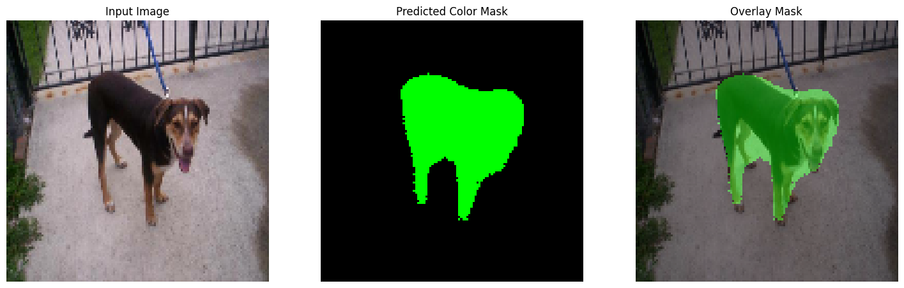
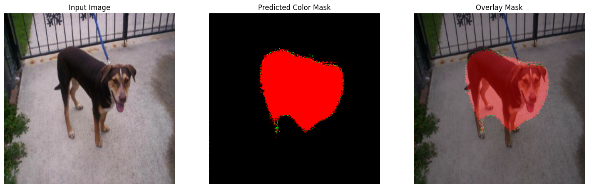
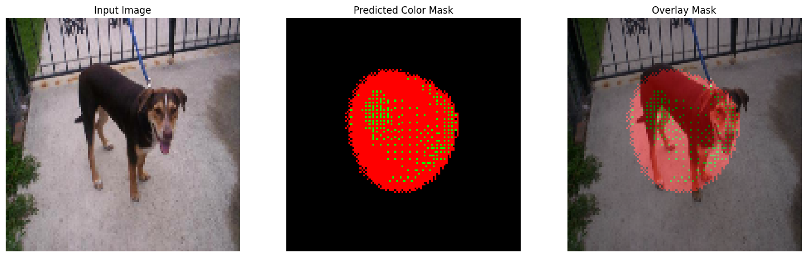

# Cat and Dog Semantic Segmentation Project

## Team Members
- **Ye Bhone Lin**
- **Te Nyain Moe Lwin** 
- **Khant Nyar KoKo**

## Project Overview

This project implements semantic segmentation for cats and dogs using U-Net architecture with transfer learning. We experimented with multiple pre-trained backbone networks including ResNet50, VGG16, and MobileNetV2 to achieve optimal segmentation performance.

## Project Goals

- Develop a robust semantic segmentation model for cat and dog detection
- Compare performance across different transfer learning architectures
- Provide real-time image overlay predictions

## Architecture

### Model Architecture
- **Base Architecture**: U-Net with encoder-decoder structure
- **Transfer Learning Approaches**:
  - ResNet50
  - VGG16
  - MobileNetV2 (Production Model)

### API Architecture
- **Framework**: FastAPI
- **Containerization**: Docker
- **Model Serving**: TensorFlow/Keras
- **Image Processing**: OpenCV, PIL

## Project Structure

```
Team_YTK/
├── api_endpoint/                 # Production API service
│   ├── main.py                  # FastAPI application
│   └── model_work.py            # Model inference logic
├── data_annotated/              # Annotation data
│   └── labels.txt               # Class labels
├── test_dataset/                # Test dataset
│   ├── anotations_json/         # LabelMe annotations
│   │   ├── cats/               # Cat annotations
│   │   └── dogs/               # Dog annotations
│   └── cats_and_dogs_filtered/  # Image dataset
├── VOC/                         # VOC format dataset
│   ├── JPEGImages/             # Original images
│   ├── SegmentationClass/      # Segmentation masks
│   └── SegmentationClass_Encoded/ # Encoded masks
├── *.ipynb                      # Jupyter notebooks for model development
├── Dockerfile                   # Container configuration
├── Pipfile                      # Python dependencies
└── README.md                    # Docs
```

## Models Tested

### 1. U-Net with ResNet50 Backbone
- **File**: `u_net_transfer_learning_resnet.ipynb`
- **Characteristics**: Deep architecture

### 2. U-Net with VGG16 Backbone  
- **File**: `u_net_transfer_learning_vgg16.ipynb`
- **Characteristics**: Classic architecture, good feature extraction

### 3. U-Net with MobileNetV2 Backbone
- **File**: `u_net_transfer_learning_mobilenetv2.ipynb`
- **Characteristics**: Lightweight, efficient

### We chose the best model based on the model accuracy and loss. 

| Model      | Train Acc | Train Loss | Val Acc | Val Loss |
|------------|-----------|------------|---------|----------|
| MobileNetV2 | **0.9567**   | **0.1189**     | **0.9430**  | **0.1643**   |
| VGG16      | 0.7246   | 0.5376     | 0.8810  | 0.7434   |
| ResNet50   | 0.6786   | 0.7334     | 0.6605  | 0.7610   |

  
*Figure 1: MobileNetV2 Overlay Image*

  
*Figure 2: VGG16 Overlay Image*

  
*Figure 3: Resnet50 Overlay Image*

Upon the images results, MobileNetV2 model outperformed VGG16 and Resnet50. 

We chose MobilenetV2 model as a production Model. 

## Quick Start

### Prerequisites
- Python 3.10
- Docker (for containerized deployment)
- pipenv (for dependency management)

### Local Development Setup

1. **Clone the repository**
   ```bash
   git clone <repository-url>
   cd Team_YTK
   ```

2. **Install dependencies**
   ```bash
   pipenv install
   pipenv shell
   ```

3. **Run the API locally**
   ```bash
   cd api_endpoint
   uvicorn main:app --reload --host 0.0.0.0 --port 8000
   ```

### Docker Deployment

#### Option 1: Pull from Docker Hub
```bash
docker pull tenyain/catsdogs-api
docker run -p 8000:8000 tenyain/catsdogs-api
```

#### Option 2: Build Locally
1. **Build the Docker image**
   ```bash
   docker build -t cat-dog-segmentation .
   ```

2. **Run the container**
   ```bash
   docker run -p 8000:8000 cat-dog-segmentation
   ```

## API Usage

### Endpoint: `/overlay_image`

**Method**: POST  
**Content-Type**: multipart/form-data

**Request**:
- Upload an image file (PNG, JPEG, JPG)

**Response**:
- PNG image with segmentation overlay

**Example using curl**:
```bash
curl -X POST "http://localhost:8000/overlay_image" \
     -H "accept: image/png" \
     -H "Content-Type: multipart/form-data" \
     -F "file=@your_image.jpg"
```

**Example using Python**:
```python
import requests

url = "http://localhost:8000/overlay_image"
files = {"file": open("your_image.jpg", "rb")}
response = requests.post(url, files=files)

with open("result.png", "wb") as f:
    f.write(response.content)
```

## Model Details

### Semantic Segmentation Classes
- **Class 0**: Background (Black)
- **Class 1**: Dog (Green)
- **Class 2**: Cat (Blue)

### Model Specifications
- **Input Size**: 128x128 pixels
- **Output**: Segmentation mask with class predictions
- **Overlay Alpha**: 0.4 (40% mask transparency)

### Performance Metrics
- Model trained on custom cat/dog dataset
- Transfer learning from ImageNet pre-trained weights
- Optimized for real-time inference

### Model Comparison Results

| Model | Training Accuracy | Training Loss | Validation Accuracy | Validation Loss |
|-------|------------------|---------------|-------------------|-----------------|
| **MobileNetV2** | 0.9567 | 0.1189 | 0.9430 | 0.1643 |
| **VGG16** | 0.7246 | 0.5376 | 0.8810 | 0.7434 |
| **ResNet50** | 0.6786 | 0.7334 | 0.6605 | 0.7610 |

**Key Findings:**
- **MobileNetV2** achieved the best performance with highest accuracy and lowest loss
- **VGG16** showed moderate performance with good validation accuracy
- **ResNet50** had the lowest performance, possibly due to overfitting on this dataset
- MobileNetV2 was selected for production due to its superior performance and efficiency

## Dataset Information

### Training Data
- **Source**: Custom annotated dataset
- **Format**: VOC (Visual Object Classes)
- **Annotation Tool**: LabelMe
- **Classes**: Cat, Dog, Background

### Data Processing
- Images resized to 128x128 for training
- Masks encoded for multi-class segmentation
- Data augmentation applied during training

## Development Workflow

1. **Data Preparation**: Use `labelme2voc.py` to convert LabelMe annotations to VOC format
2. **Model Training**: Run Jupyter notebooks for different architectures
3. **Model Evaluation**: Compare performance across backbones
4. **API Development**: Implement FastAPI service with model inference
5. **Deployment**: Containerize with Docker for production

## Key Features

- **Real-time Inference**: Fast prediction and overlay generation
- **Multi-format Support**: Accepts PNG, JPEG, JPG images
- **Transfer Learning**: Leverages pre-trained ImageNet weights
- **Production Optimized**: MobileNetV2 for efficiency

## Technical Stack

- **Deep Learning**: TensorFlow/Keras
- **Web Framework**: FastAPI
- **Image Processing**: OpenCV, PIL
- **Containerization**: Docker
- **Dependency Management**: Pipenv

## Contributing

This project was developed as a collaborative effort by Team YTK. All team members contributed to:
- Data annotation and preprocessing
- Model architecture experimentation
- API development and deployment
- Documentation and testing

## License

This project is developed for educational purposes as part of the Practical ML by WAI course.

---

**Team YTK** - Cat and Dog Semantic Segmentation Project  
*Ye Bhone Lin | Te Nyain Moe Lwin | Khant Nyar KoKo*
